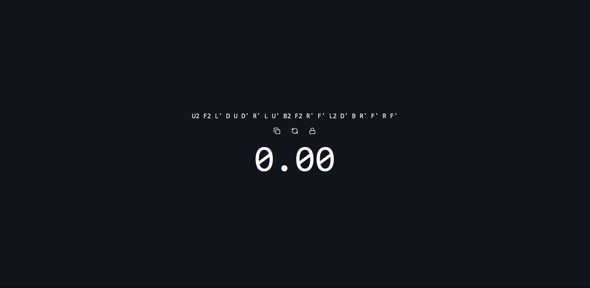

# Kyubtym

## What is this?

Kyubtym is a really simple opinionated featureless cube timer.

Thats it. Nothing more, nothing less.

## (Planned) Features

- [ ] Time history and lifetime statistics
- [ ] Displays the time in a nice format
- [ ] Good scrambles
- [ ] Ambience
- [x] Everything stored locally (nothing is stored yet)
- [ ] aI fUnCtIoNaLiTy (just kidding, probably shows possible solutions after timer stops, or before maybe)
- [ ] Nice UI
- [ ] Records your sessions (webcam, \*optional)

## Notes

This is a personal project, so it might not be the best code. The web app does not have all the features, like recording. Theres a desktop app planned for that.

## Demo (In development)

Do note its still work in progress
